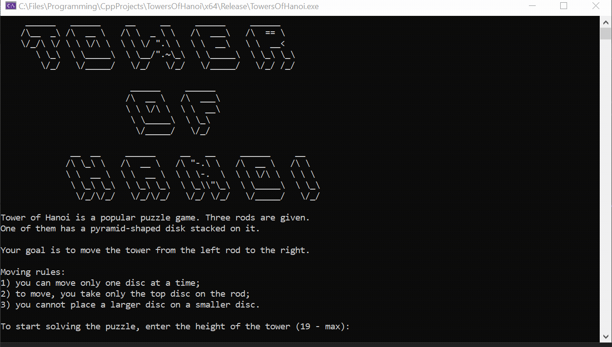

# TowerOfHanoi

## Demo

## Note
The application is designed for a console width of **120 characters**. So it is recommended that you change the width of the console if the graphics are not displayed correctly.

## What can be improved?
* The maximum size of the tower will should depend on the size of the console window  
* Ability to exit to the menu during the game  
* Instead of three arrays responsible for the contents of the rods, implement an array with these arrays. This will be useful if one wants to make any number of rods.  
* Fix bad English  
* Code review and refactoring  
